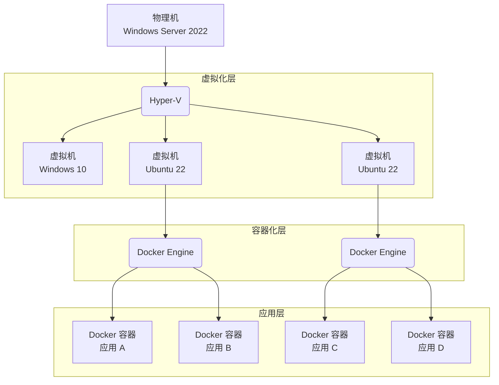

```mermaid

graph TD
    A[物理机<br>Windows Server 2022] --> B(Hyper-V)

    subgraph 虚拟化层
        B --> C[虚拟机<br>Windows 10]
        B --> D[虚拟机<br>Ubuntu 22]
        B --> E[虚拟机<br>Ubuntu 22]
    end

    subgraph 容器化层
        D --> F(Docker Engine)
        E --> G(Docker Engine)
    end

    subgraph 应用层
        F --> H[Docker 容器<br>应用 A]
        F --> I[Docker 容器<br>应用 B]
        G --> J[Docker 容器<br>应用 C]
        G --> K[Docker 容器<br>应用 D]
    end

```