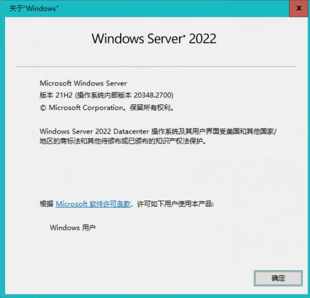
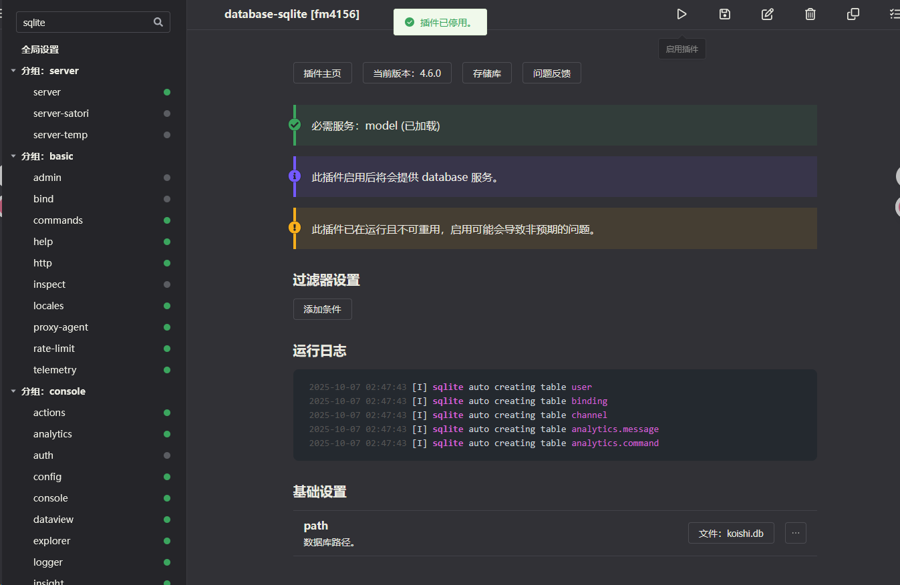
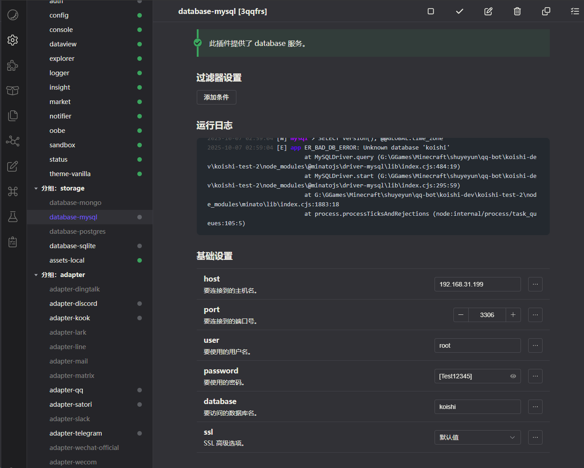
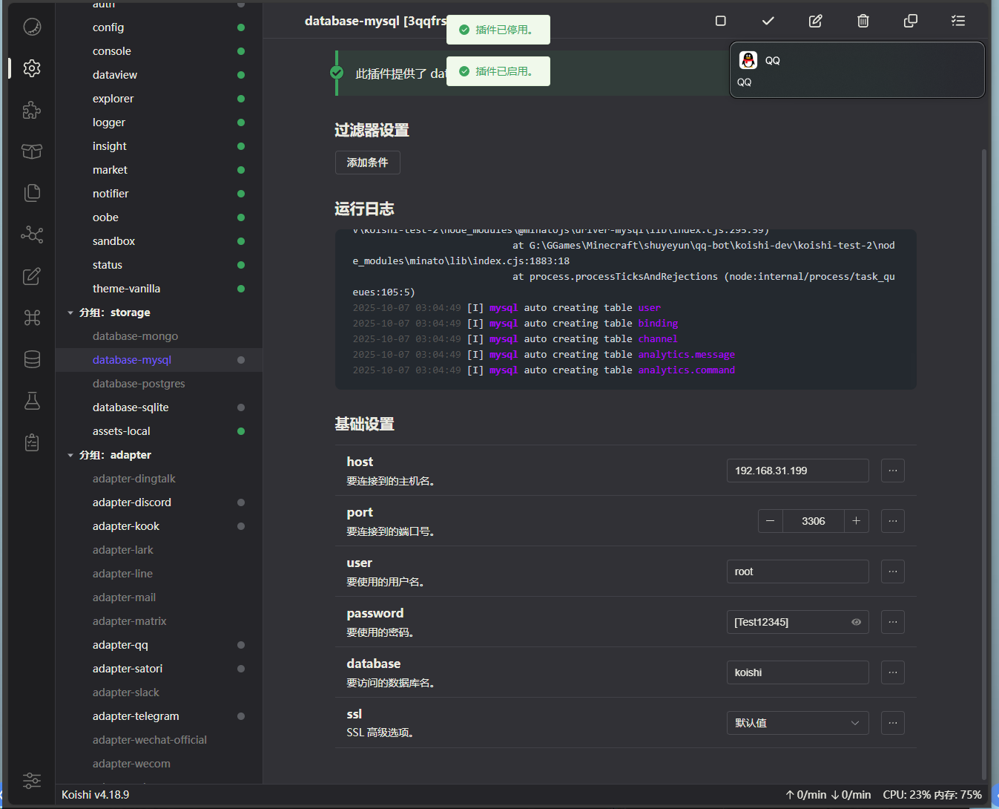

## My env:

### winver


### docker version:
```shell
PS C:\WINDOWS\system32> docker --version
Docker version 28.4.0, build d8eb465
```

### mysql command:
(powershell) ↓
```shell

mkdir A:\TMP\mysql_docker_test\data
mkdir A:\TMP\mysql_docker_test\logs
mkdir A:\TMP\mysql_docker_test\config

docker run -d `
  --name mysql-test `
  -p 3306:3306 `
  -e MYSQL_ROOT_PASSWORD=[Test12345] `
  mysql:latest
```

因为挂载目录可能会遇到一些权限问题，所以先不持久化，后面再说：
持久化的参数: 
```shell
  -v D:\TMP\mysql_docker_test\data:/var/lib/mysql `   # <-- 1. 主数据目录
  -v D:\TMP\mysql_docker_test\logs:/var/log/mysql `   # <-- 2. 日志目录
  -v D:\TMP\mysql_docker_test\config:/etc/mysql/conf.d ` # <-- 3. 配置目录
```

### 看看运行状态
```shell
PS C:\WINDOWS\system32> docker ps -a | Select-String -Pattern "mysql"

b92ae46816d7   mysql:latest                          "docker-entrypoint.s鈥?   8 minutes ago   Up 8 minutes             0.0.0.0:3306->3306/tcp, [::]:3306->3306/tcp   mysql
-test

```

### create a new koishi instance
```shell
PS G:\GGames\Minecraft\shuyeyun\qq-bot\koishi-dev> yarn create koishi
yarn create v1.22.22
[1/4] Resolving packages...
[2/4] Fetching packages...
[3/4] Linking dependencies...
[4/4] Building fresh packages...

success Installed "create-koishi@6.3.2" with binaries:
      - create-koishi
[########################################################################################################] 104/104
  Create Koishi  v6.3.2

√ Project name: ... koishi-test-2
  Scaffolding project in koishi-test-2 ...
  Done.

? Install and start it now? » (Y/n)
```

### dispose koishi-plugin-database-sqlite


### install and configure koishi-plugin-database-mysql



> huh? 等下？ 这是需要我手动创建一个名字叫做koishi的database吗？
```log
2025-10-07 02:59:04 [W] mysql > SELECT version(), @@GLOBAL.time_zone
2025-10-07 02:59:04 [E] app ER_BAD_DB_ERROR: Unknown database 'koishi'
                            at MySQLDriver.query (G:\GGames\Minecraft\shuyeyun\qq-bot\koishi-dev\koishi-test-2\node_modules\@minatojs\driver-mysql\lib\index.cjs:484:19)
                            at MySQLDriver.start (G:\GGames\Minecraft\shuyeyun\qq-bot\koishi-dev\koishi-test-2\node_modules\@minatojs\driver-mysql\lib\index.cjs:295:59)
                            at G:\GGames\Minecraft\shuyeyun\qq-bot\koishi-dev\koishi-test-2\node_modules\minato\lib\index.cjs:1883:18
                            at process.processTicksAndRejections (node:internal/process/task_queues:105:5)
```

> 66,等我手动创建一个 名字叫做koishi的database试试看
```shell
PS C:\WINDOWS\system32> docker exec -it mysql-test bash
bash-5.1# mysql -u root -p
Enter password:
Welcome to the MySQL monitor.  Commands end with ; or \g.
Your MySQL connection id is 12
Server version: 9.4.0 MySQL Community Server - GPL

Copyright (c) 2000, 2025, Oracle and/or its affiliates.

Oracle is a registered trademark of Oracle Corporation and/or its
affiliates. Other names may be trademarks of their respective
owners.

Type 'help;' or '\h' for help. Type '\c' to clear the current input statement.

mysql> CREATE DATABASE koishi CHARACTER SET utf8mb4 COLLATE utf8mb4_unicode_ci;
Query OK, 1 row affected (0.023 sec)

mysql>
```
> done! 现在再重载一下koishi-plugin-database-mysql试试看:

```log
2025-10-07 03:04:49 [I] mysql auto creating table user
2025-10-07 03:04:49 [I] mysql auto creating table binding
2025-10-07 03:04:49 [I] mysql auto creating table channel
2025-10-07 03:04:49 [I] mysql auto creating table analytics.message
2025-10-07 03:04:49 [I] mysql auto creating table analytics.command
```
> great！成了！

> 再去mysql shell看看：

```shell
mysql> USE koishi;
Reading table information for completion of table and column names
You can turn off this feature to get a quicker startup with -A

Database changed
mysql> SHOW TABLES;
+-------------------+
| Tables_in_koishi  |
+-------------------+
| analytics.command |
| analytics.message |
| binding           |
| channel           |
| user              |
+-------------------+
5 rows in set (0.002 sec)

mysql>
```

> done!

### little conclusion:

看到配置项里面有一个叫做：`database 要访问的数据库名`
那这个时候就可以猜出一个结论了。

先梳理SQLite3等和MySQL等 这两类数据库的特点： 

  - 文件即数据库 (File-as-Database)
    > 比如`SQLite3`,`H2`,  它们将整个database（所有tables、indexes、views、triggers等等的集合）存储在一个或几个本地文件中
  
  - 客户端-服务器数据库 (Client-Server Database)
    > 比如`MySQL`, `PostgreSQL`, `MongoDB`, 一个服务器实例可以管理多个database

所以得出结论：
**一个koishi实例 只需要一个database**


