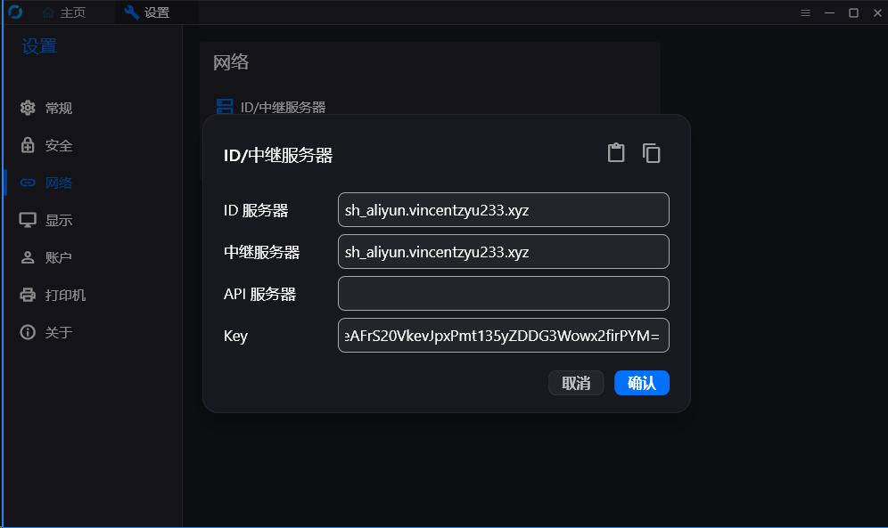
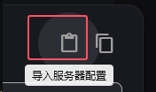

### rustdesk远程桌面

主控端和被控端只需要填入相同的网络设置，然后就可以用id和密码进行连接

#### 设置导入 法1：
##### 复制这个：

> 9JSPNlFUylmZyg3dvd1MHRERalXNzEDdtBFewpkdltmVwIzUyZUQltCUktCM1IiOikXZrJCLiIiOikGchJCLioXe45yMzITd5pHduV2Yulmdu4Wd5lGbh9FazJiOikXYsVmciwiI6lHeuMzMyUXe6RnblNmbpZnLuVXepxWYfh2ciojI0N3boJye

然后点左边导入配置

#### 设置导入 法2：
##### id服务器和中继服务器写这个：
> sh_aliyun.vincentzyu233.xyz

##### API服务器不填。
> 50+dP+eAFrS20VkevJpxPmt135yZDDG3Wowx2firPYM=

##### Key写这个:
> 50+dP+eAFrS20VkevJpxPmt135yZDDG3Wowx2firPYM=
