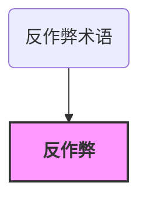
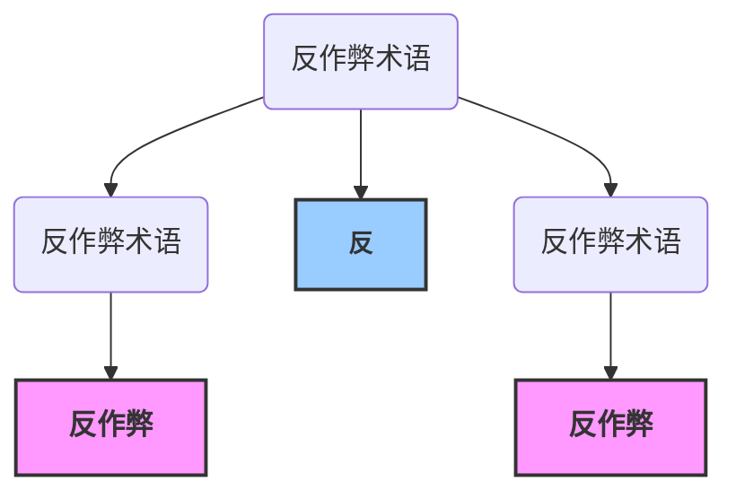
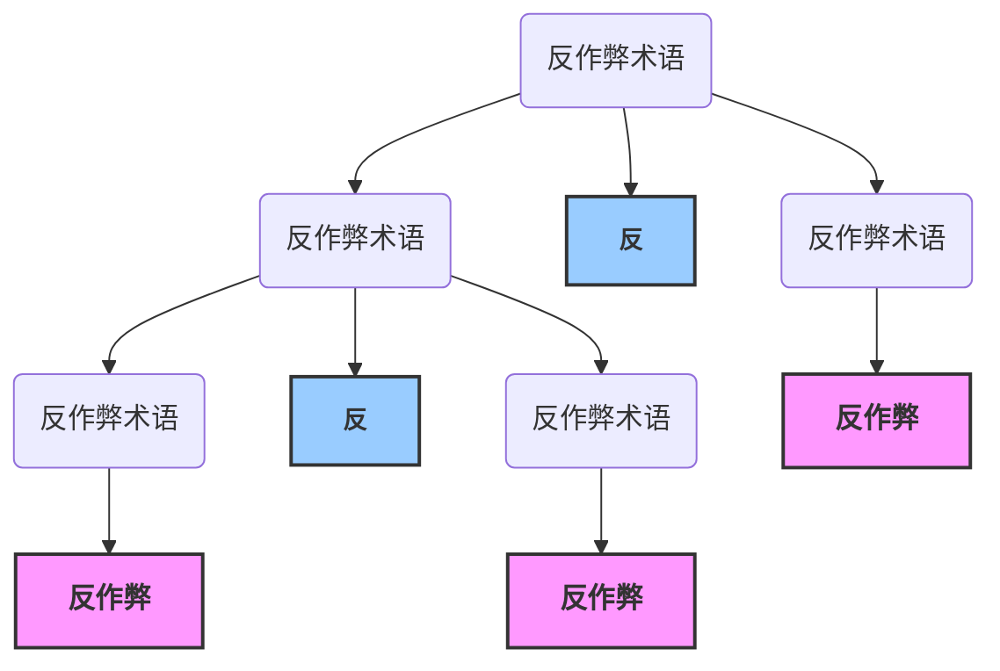
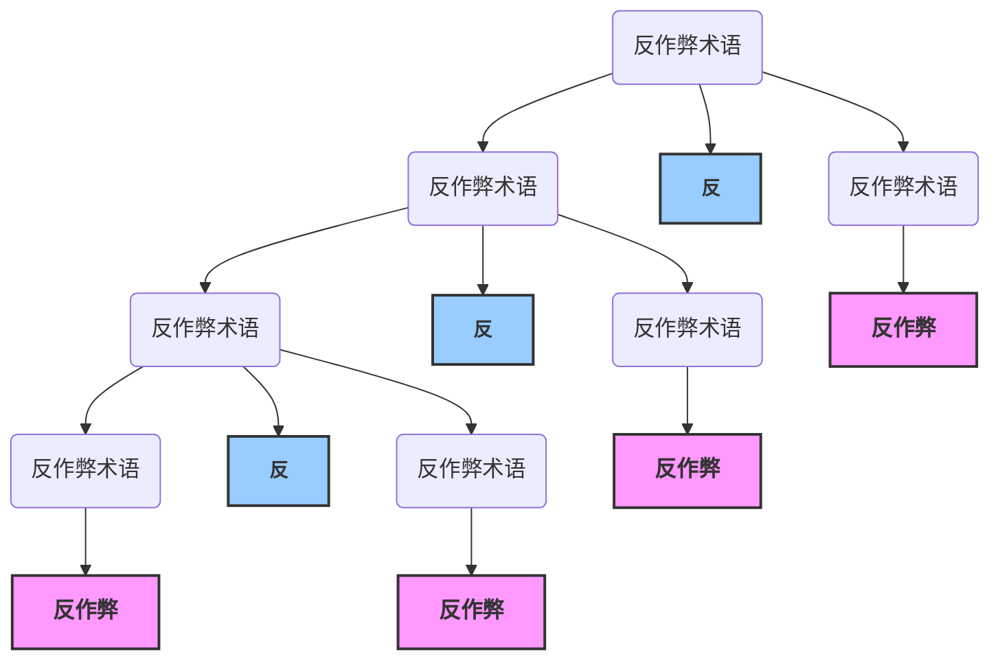
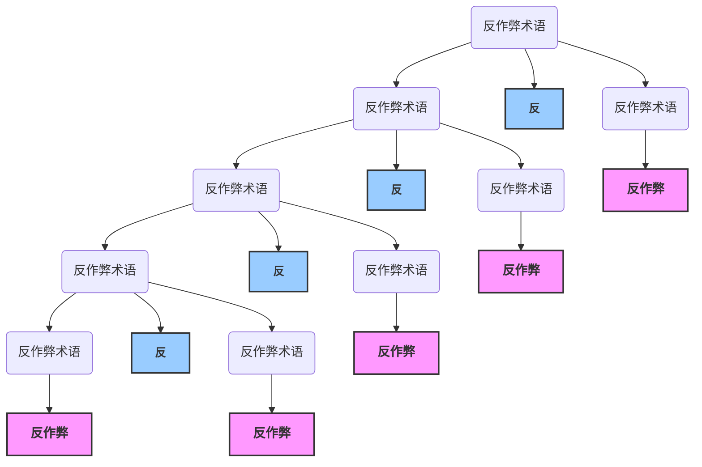

# 反作弊

```mermaid
graph TD
    A("反作弊术语") --> B["反作弊"]
    class B leaf_node
    classDef leaf_node fill:#f9f,stroke:#333,stroke-width:2px,font-weight:bold,font-size:16px;
```

# 反作弊反反作弊

```mermaid
graph TD
    A("反作弊术语") --> B("反作弊术语")
    A --> C["反"]
    A --> D("反作弊术语")
    B --> E["反作弊"]
    D --> F["反作弊"]
    class E,F leaf_node
    class C terminal_node
    classDef leaf_node fill:#f9f,stroke:#333,stroke-width:2px,font-weight:bold,font-size:16px;
    classDef terminal_node fill:#9cf,stroke:#333,stroke-width:2px,font-weight:bold,font-size:14px;
```

# 反作弊反反作弊反反作弊

```mermaid
graph TD
    A("反作弊术语") --> B("反作弊术语")
    A --> C["反"]
    A --> D("反作弊术语")
    
    B --> E("反作弊术语")
    B --> F["反"]
    B --> G("反作弊术语")
    
    E --> H["反作弊"]
    G --> I["反作弊"]
    D --> J["反作弊"]

    class H,I,J leaf_node
    class C,F terminal_node
    classDef leaf_node fill:#f9f,stroke:#333,stroke-width:2px,font-weight:bold,font-size:16px;
    classDef terminal_node fill:#9cf,stroke:#333,stroke-width:2px,font-weight:bold,font-size:14px;
```

# 反作弊反反作弊反反作弊反反作弊

```mermaid
graph TD
    A("反作弊术语") --> B("反作弊术语")
    A --> C["反"]
    A --> D("反作弊术语")
    
    B --> E("反作弊术语")
    B --> F["反"]
    B --> G("反作弊术语")
    
    E --> H("反作弊术语")
    E --> I["反"]
    E --> J("反作弊术语")
    
    H --> K["反作弊"]
    J --> L["反作弊"]
    G --> M["反作弊"]
    D --> N["反作弊"]

    class K,L,M,N leaf_node
    class C,F,I terminal_node
    classDef leaf_node fill:#f9f,stroke:#333,stroke-width:2px,font-weight:bold,font-size:16px;
    classDef terminal_node fill:#9cf,stroke:#333,stroke-width:2px,font-weight:bold,font-size:14px;
```

# 反作弊反反作弊反反作弊反反作弊反反作弊

```mermaid
graph TD
    A("反作弊术语") --> B("反作弊术语")
    A --> C["反"]
    A --> D("反作弊术语")
    
    B --> E("反作弊术语")
    B --> F["反"]
    B --> G("反作弊术语")
    
    E --> H("反作弊术语")
    E --> I["反"]
    E --> J("反作弊术语")
    
    H --> K("反作弊术语")
    H --> L["反"]
    H --> M("反作弊术语")
    
    K --> N["反作弊"]
    M --> O["反作弊"]
    J --> P["反作弊"]
    G --> Q["反作弊"]
    D --> R["反作弊"]

    class N,O,P,Q,R leaf_node
    class C,F,I,L terminal_node
    classDef leaf_node fill:#f9f,stroke:#333,stroke-width:2px,font-weight:bold,font-size:16px;
    classDef terminal_node fill:#9cf,stroke:#333,stroke-width:2px,font-weight:bold,font-size:14px;
```