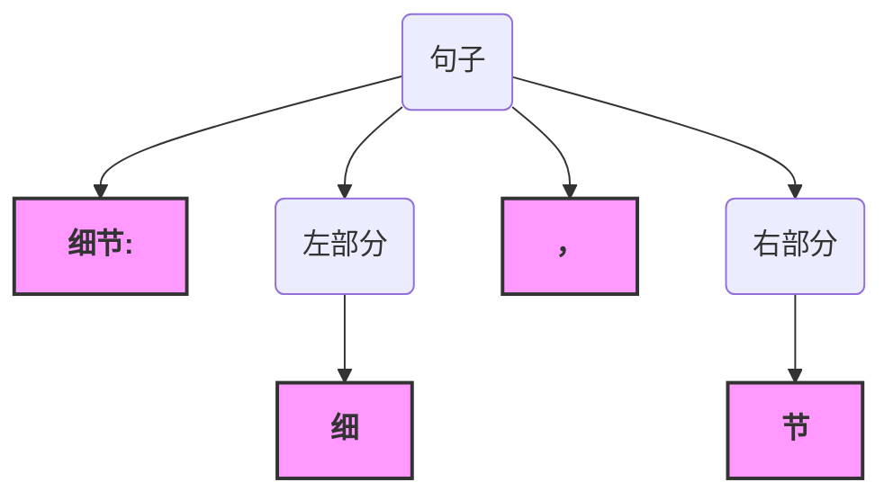
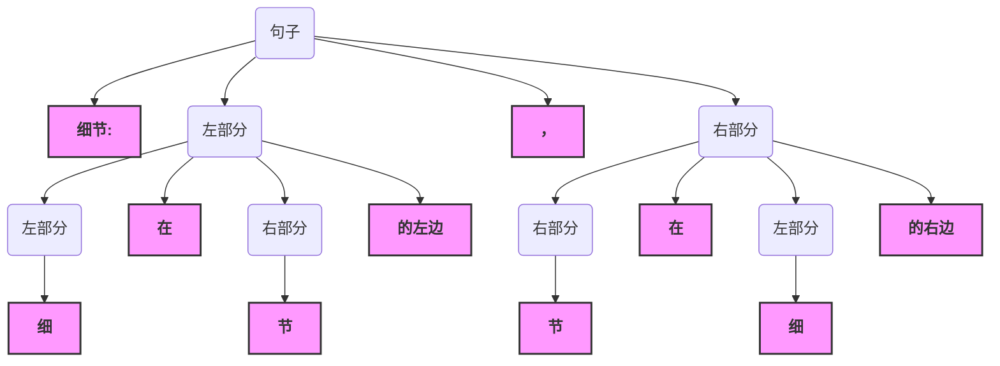
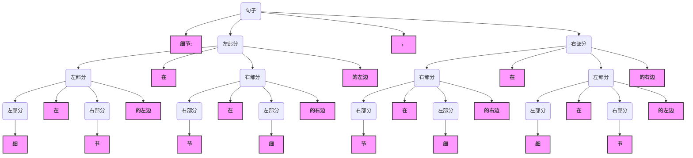
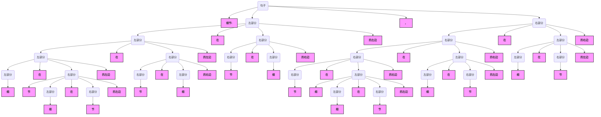

# 细节文法
 1. <句子> ::= "细节:" <左部分> "，" <右部分>

 2. <左部分> ::= "细" | <左部分> "在" <右部分> "的左边"

 3. <右部分> ::= "节" | <右部分> "在" <左部分> "的右边"

## 细节:细，节

## 细节:细在节的左边，节在细的右边

## 细节:细在节的左边在节在细的右边的左边，节在细的右边在细在节的左边的右边

## 细节:细在节的左边在节在细的右边的左边在节在细的右边在细在节的左边的右边的左边，节在细的右边在细在节的左边的右边在细在节的左边在节在细的右边的左边的右边
