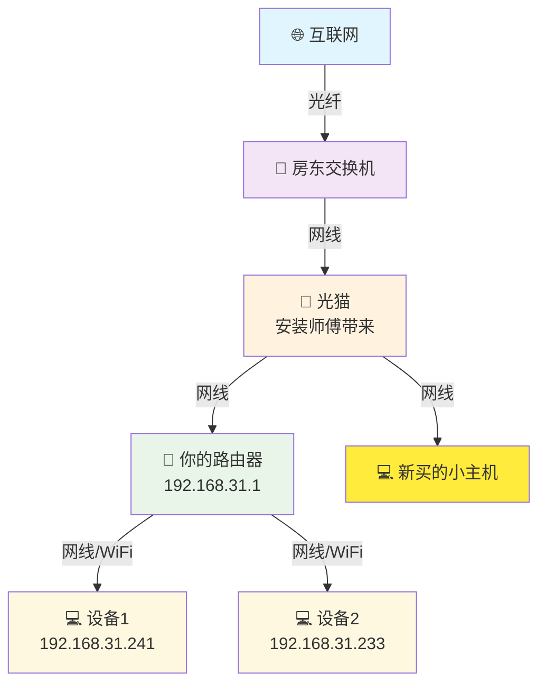
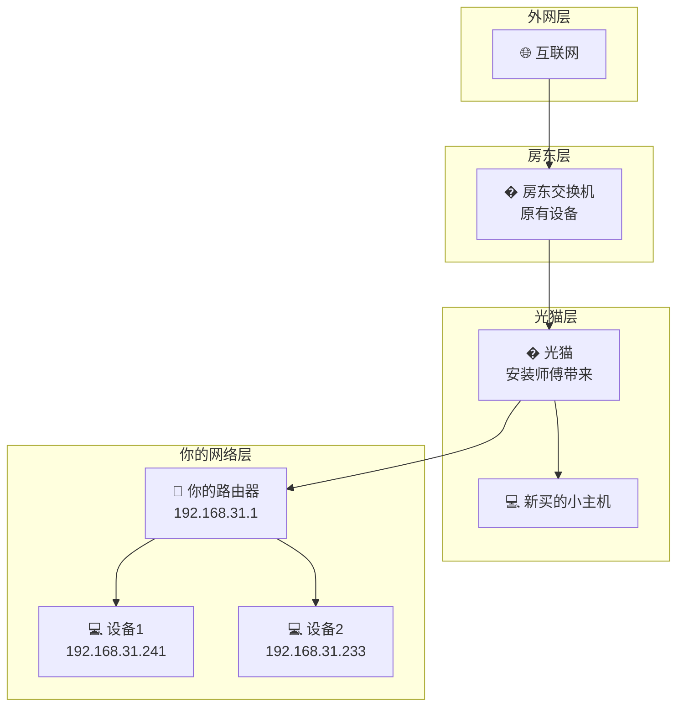

# 网络拓扑图

## 当前网络架构

## 网络层级图

## 网络信息
- **你的路由器网关**: 192.168.31.1
- **连接状态**: 正常 (延迟<1ms, TTL=64)
- **网络架构**: 三级转发 (光猫 → 交换机 → 路由器)

## 连接说明
1. 🌐 **互联网** - 通过光纤接入
2. � **房东交换机** - 房东原有的网络分发设备
3. � **光猫** - 安装师傅带来的光电转换设备
4. 📶 **你的路由器** - 192.168.31.1，为你的设备提供局域网和WiFi
5. 💻 **新买的小主机** - 直接连接光猫
6. 💻 **你的设备** - 通过路由器连接：192.168.31.241, 192.168.31.233

## 可能的网络段分析
- 光猫可能使用: `192.168.1.x` 或运营商指定段
- 房东交换机: 可能桥接模式或 `192.168.0.x`  
- 你的路由器: `192.168.31.x` (小米路由器默认段)