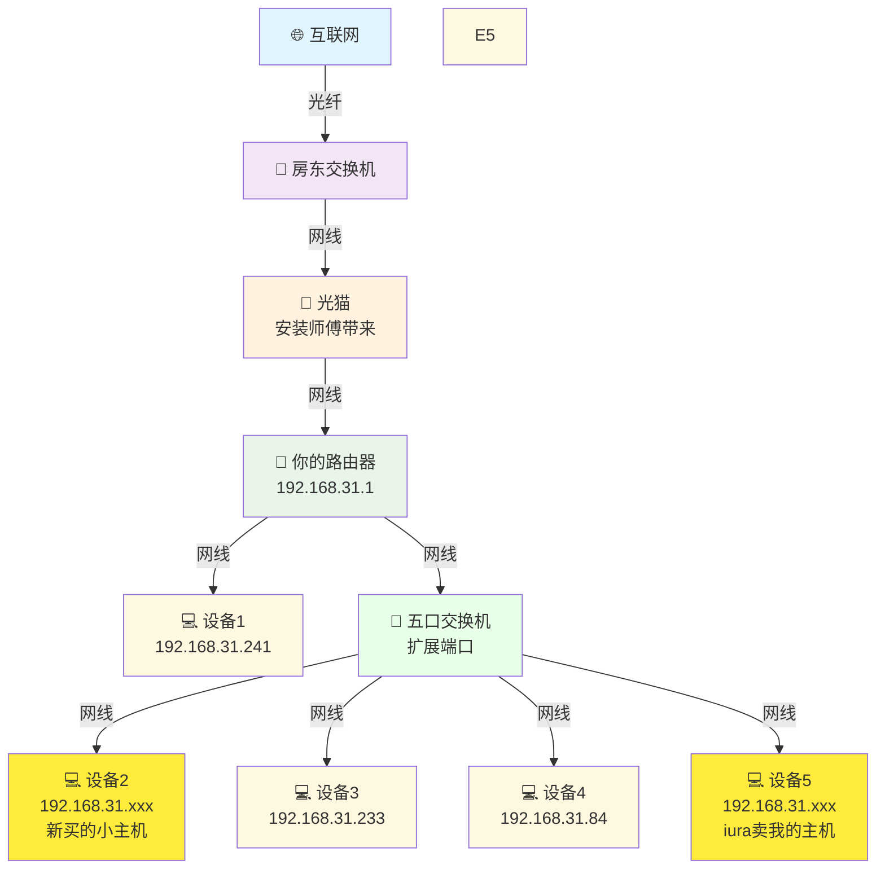
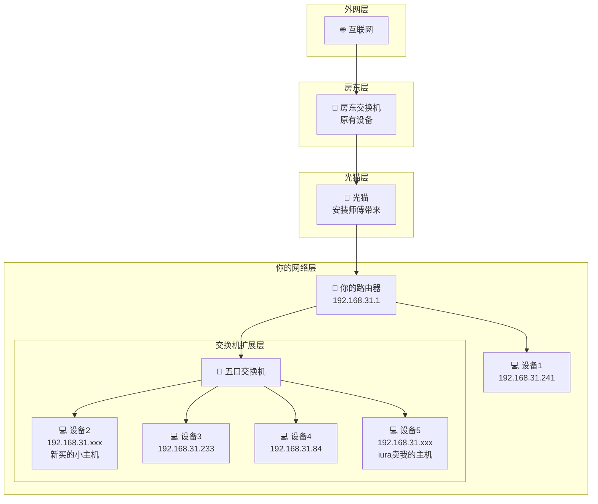

# 网络拓扑图 - 升级版

## 当前网络架构（添加五口交换机）

## 网络层级图（升级版）

## 网络信息
- **你的路由器网关**: 192.168.31.1
- **五口交换机**: 透明转发，不分配IP
- **连接状态**: 正常 (延迟<1ms, TTL=64)
- **网络架构**: 四级转发 (光猫 → 交换机 → 路由器 → 五口交换机)

## 连接说明
1. 🌐 **互联网** - 通过光纤接入
2. 🔌 **房东交换机** - 房东原有的网络分发设备
3. 📡 **光猫** - 安装师傅带来的光电转换设备
4. 📶 **你的路由器** - 192.168.31.1，为你的设备提供局域网和WiFi
5. 🔗 **五口交换机** - 扩展网络端口，透明转发数据
6. 💻 **新买的小主机** - 直接连接光猫
7. 💻 **你的设备** - 通过五口交换机连接：192.168.31.241, 192.168.31.233, 及其他设备

## 优势分析
- ✅ **端口扩展**: 从路由器的有限端口扩展到5个有线端口
- ✅ **网络性能**: 交换机内部通信速度更快
- ✅ **灵活布线**: 可以将交换机放在更方便的位置
- ✅ **成本效益**: 五口交换机价格便宜，性价比高

## 可能的网络段分析
- 光猫可能使用: `192.168.1.x` 或运营商指定段
- 房东交换机: 可能桥接模式或 `192.168.0.x`  
- 你的路由器: `192.168.31.x` (小米路由器默认段)
- 五口交换机: 二层设备，透明转发，不占用IP
