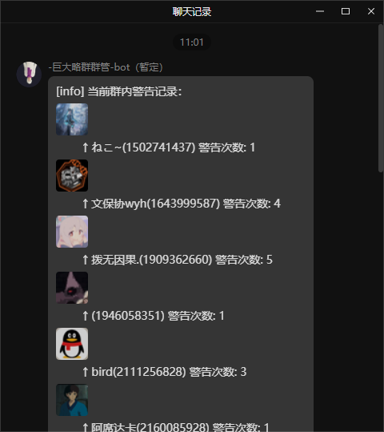

# bot运维日志20250525

> q群里只保留最新的日志，所有日志见kook频道：
`https://kook.vip/0SnmG0`

## 1. warn指令规则修改
  鉴于群员众多，管理无法记住每个人的违规次数。因此借助bot记录次数。

  - 第1次warn: 撤回消息并警告
  - 第2次warn：禁言1分钟。
  - 第3次warn：禁言10分钟。
  - 第4次warn：移出群聊。
  - 第5次warn：移出群聊并加入黑名单。

> **在第4次时将会被移出群聊，你有权重新加回群聊，但如果再次违反群规(第5次warn)，管理员有权将你再次移出群聊，并加入黑名单。**

## 2.warn增加公示
  所有被warn的人 都会在kook频道有公示记录:https://kook.vip/0SnmG0

## 3.其他细节优化
  比如warn.list显示人名，头像等等
  