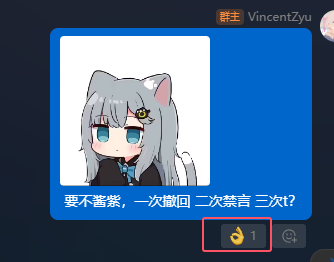

## 1.涩图表情反馈
这个消息气泡下方的表情反馈 涩图检测 要不要开？ （现在有 ok表情 和 问号 表情两种，我打算大群里只反馈问号，不反馈OK）

## 2.T人流程 配合bot半自动化
有关t人标准，我有个想法，要不就这： 在群规里明确规定， 1次撤回警告，2次禁言警告，3次踢人

> 这套流程我觉得可以用bot做，我写成一个指令，比如 "warn @用户名", 用bot来做计数

## 3.新的特性？
bot还有其他功能要做的吗？ 你们感觉