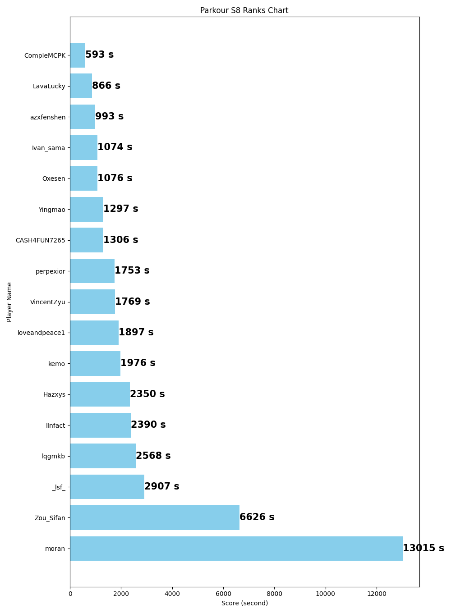

## Minecraft服务器运维日志

### 新增小游戏合集
[Java 1.21.5 原版可进] 
mc.vincentzyu233.xyz:23356
(请先用ip直连，后面会接入velocity群组)

小游戏合集相当的全：
> 枪战，狼人杀，羊毛战争，生存战争，密室杀手，击退，烫手山芋，TNTRUN，色盲大战，PVE，信仰方块，起床，战桥，职业战争，追杀游戏，饥饿游戏，竞速，方块躲猫猫，道具躲猫猫，小游戏派对，TNT战争，船战，云端决战，赛猪，吸血鬼之夜，桌游，棋类，跑酷，星跳水立方，迷宫，美食派对，高尔夫

### Hielke跑酷s8 -> s9
> 截止至2025-05-08 周四 18:30pm， Hielke跑酷图已经有17人完赛，45人参与

次数查看计分板：
(浏览器打开)https://mc.vincentzyu233.xyz/qsfrontend/#/
或者直接群小程序查看

Hielke跑酷子服即将于 2025-05-11 周日 12:30pm 进行跑酷图更换
下一张地图：维度跑酷Dimension Parkrour(s9赛季)
https://hielkemaps.com/maps/dimension-parkour

### 新增两张优秀国产图

分别来自两位优秀国产跑酷图作者
- Klue - 死亡跑酷

- Andy - 裂纹跑酷

(后续也将接入计分板)

### 有关新生存服的讨论

- 方案1: 1.21.4fabric，生电模组相对齐全，但是无规则，无领地，类似2b2t
- 方案2: 最新的fabric快照，有最新的特性，比如乐魂
- 方案3：1.21.5 Leaves或者Purpur spigot下游 插件服，有领地 货币 箱子商店
  
  awa 你们觉得哪种好？ 后面我会开一个群投票 看看吧

### 目前服务器的所有子服：

#### 小游戏类：
> Bingo、随机方块pvp、背刺-谁是杀手-、惊天矿工团、rougecraft、传说之下竞技场、造艘船捞钻石、(最新增加的)小游戏合集

#### 生存类:
> MixPixel1.17 插件 副本 生存
> （考虑新增） 1.21.x 新版本的生存

#### 跑酷类:
> （即将更新s9）Hielke跑酷图 跑酷蛋ParkourEgg -> 维度跑酷DimensionParkour
> （最新增加）Klue跑酷图 死亡跑酷
> （最新增加）Andy跑酷图 裂纹跑酷